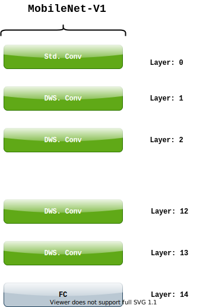

=================
Lambda Mobilenets
=================

Mobilenets with Lambda layers

Lambda Networks proposed in `LambdaNetworks: Modeling Long Range Interactions without Attention <https://openreview.net/pdf?id=xTJEN-ggl1b>`_.

Install
=======

We use the implementation done by `lucidrains <https://github.com/lucidrains/lambda-networks>`_

.. code-block:: bash

   pip install lambda-networks
   
   
Method
======

We replace some layers in MobileNet-v1 architecture with lambda layer. It significantly reduces the parameters with some performance gain on cifar100 dataset.

MobileNet-v1 architecture:

The following table shows which layer to replace and remove to get the performance boost:
C: Conv layer same as in original architecture
L: Lambda layer
Blank cell represents that the layer is removed (replaced with identity layer)

+----+----------------------------------------------------------------+------------+------------+
|    |                  Layer number and Type                         |            |            |
+----+---+---+---+---+---+---+---+---+---+---+----+----+----+----+----+------------+------------+
| Id | 0 | 1 | 2 | 3 | 4 | 5 | 6 | 7 | 8 | 9 | 10 | 11 | 12 | 13 | 14 | Params (M) |  Top-1 (%) |
+----+---+---+---+---+---+---+---+---+---+---+----+----+----+----+----+------------+------------+
| A1 | C | C | C | C | C | C | C | C | C | C | C  |  C |  C |  C | FC |    3.30    |    65.54   |
+----+---+---+---+---+---+---+---+---+---+---+----+----+----+----+----+------------+------------+
| A2 | C | C | C | C | C | C | C | C |   |   |    |    |  L |  C | FC |    1.84    |    69.48   |
+----+---+---+---+---+---+---+---+---+---+---+----+----+----+----+----+------------+------------+
| A3 | C | C | C | C | C | C | C | C | L | C | L  | C  |  L |  C | FC |    2.53    |    65.25   |
+----+---+---+---+---+---+---+---+---+---+---+----+----+----+----+----+------------+------------+
| A4 | C | C | C | C | C | C | C | C | L |   |    |    |  C |    | FC |    1.24    |    68.22   |
+----+---+---+---+---+---+---+---+---+---+---+----+----+----+----+----+------------+------------+
| A5 | C | C | C | C | C | C | L |   |   |   |    |    |  C |    | FC |    0.80    |    69.91   |
+----+---+---+---+---+---+---+---+---+---+---+----+----+----+----+----+------------+------------+
| A6 | C | C | C |   | C |   | L |   |   |   |    |    |  C |    | FC |    0.71    |    66.38   |
+----+---+---+---+---+---+---+---+---+---+---+----+----+----+----+----+------------+------------+
